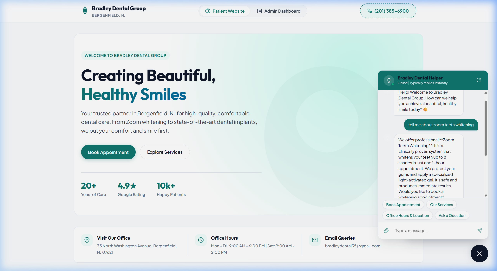
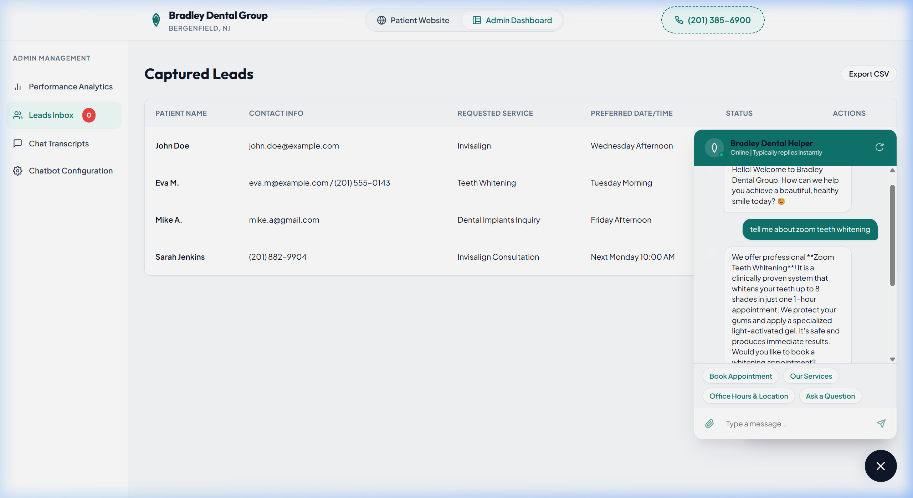

# Bradley Dental Group Chatbot & Admin Console

An interactive, premium web application built for **Bradley Dental Group** (Bergenfield, NJ). It showcases a customized AI-like chatbot widget embedded within a patient-facing landing page, paired with an Administrative Console to manage settings, view chat logs, and track captured leads.

## Previews

### Chatbot Widget in Action


### Administrative Dashboard


## Features

1. **Patient Landing Page Preview**: 
   - A modern, high-conversion redesign of the Bradley Dental Group website.
   - Highlights core services (Zoom Whitening, Dental Implants, Invisalign, Botox/Xeomin, Root Canals, Extractions).
   - Showcases real patient testimonials (Mike A., Eva M.).
   - Displays office hours, contact details, and location.

2. **Floating Chatbot Widget (`Bradley Dental Helper`)**:
   - Pulses with active status and is styled with a gorgeous, high-contrast theme customized by the admin.
   - Responds to query keywords (e.g. costs, times, procedures, locations) using a simulated NLP matching engine.
   - **Interactive Appointment Booking Funnel**: Guides users through a multi-step conversation collecting their Name, Contact Information, Desired Service, and Time preferences. Logs inputs as leads.
   - Supports quick replies for faster patient navigation.

3. **Admin Dashboard Console**:
   - **Performance Analytics**: Real-time stats counting Total Chats, Leads Captured, and Conversion Rate (leads/chats). Includes visual graphs for weekly lead trends.
   - **Leads Inbox**: View, update status (New, Contacted, Completed), and delete patient leads. Includes a **CSV Export** tool.
   - **Chat Transcripts Log**: Review full conversation histories between patients and the chatbot. Includes a quick filter search.
   - **Chatbot Configurator**: Modify the bot's header title, theme colors, default greeting message, system prompt tone, and quick reply triggers. Updates apply instantly to the patient chatbot view.

## Technologies Used
- **HTML5 & Vanilla JavaScript**: For lightweight, responsive, and robust core layouts and states.
- **CSS3 Variables**: Custom property themes linked directly to settings panel elements for instant color updates.
- **LocalStorage API**: Simulates database operations by storing configuration, sessions, and leads locally across browser refreshes.

## Getting Started

1. Open [index.html](file:///c:/Users/divya/OneDrive/Desktop/Divyajeet%20Singh%20%20Fx/workspace%203/upwork/dentist/index.html) directly in any web browser.
2. Alternatively, run a local web server in this directory:
   ```bash
   # Using Python 3
   python -m http.server 8080
   
   # Using Node.js
   npx live-server
   ```
3. Visit `http://localhost:8080` in your web browser.
